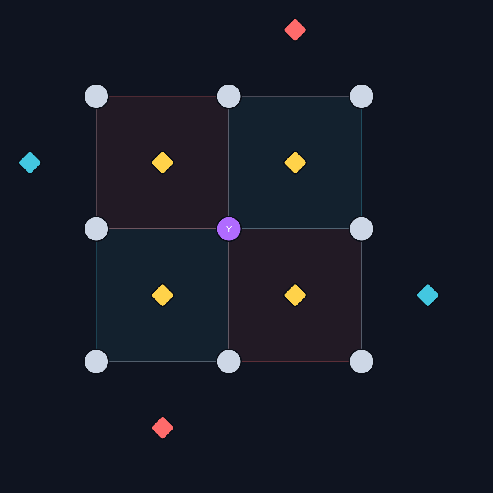
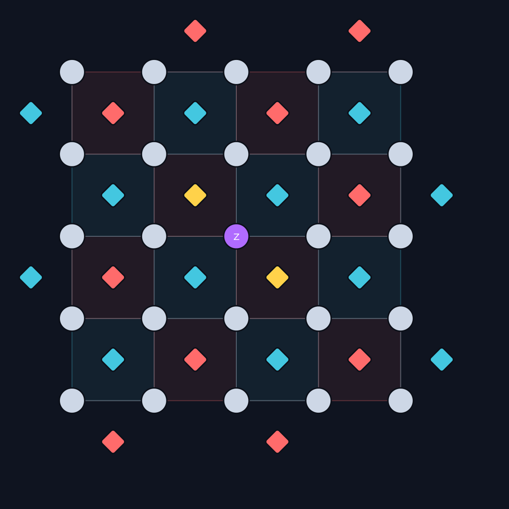

# General distance-d surface code — implementation & validation

This documents the Phase 2 backend's first-principles rotated surface code
(`src/backend_stim/surface_code.py`), the rationale behind it, the evidence that
it is correct, and the web visualization built on top of it. It satisfies
roadmap items **2-3** (general-d circuit) and most of **2-1** (fault injection);
see [`PHASE2_PLAN.md`](PHASE2_PLAN.md) and the schedule research in
[`PHASE2_DESIGN.md`](PHASE2_DESIGN.md).

## 1. Goal

Replace Phase 0's toy d=3 PennyLane simulator (which measured stabilizers
**sequentially**, so per-round depth grew with the number of stabilizers) with a
construction that:

1. uses the **constant-depth** schedule real surface codes run — **4 CNOT ticks
   per round, independent of `d`**;
2. **scales to general `d`** (3, 5, 7, …);
3. is **built by us from explicit geometric rules**, not delegated to
   `stim.Circuit.generated`, and then **validated** against Stim.

## 2. Construction rules (first principles)

Integer coordinates on a `2d × 2d` grid.

**Qubits**
- **Data** at odd–odd points `(2i+1, 2j+1)`, `i, j ∈ 0..d-1` → `d²` qubits.
- **Ancilla** at even–even face centers `(x, y)`, `x, y ∈ {0,2,…,2d}`, included iff
  - interior (`0<x<2d` and `0<y<2d`): always; or
  - top/bottom boundary (`y ∈ {0, 2d}`): only if **X-type**; or
  - left/right boundary (`x ∈ {0, 2d}`): only if **Z-type**.
  Corners are excluded. This yields exactly `d²−1` ancillas = `(d−1)²` interior
  (weight-4) + `2(d−1)` boundary (weight-2).
- **Type**: `X` if `(x//2 + y//2)` is odd, else `Z`.

**Constant-depth hook-safe schedule.** Each ancilla couples to its existing
corner data qubits in a fixed 4-tick order, identical for all ancillas of a type:

| corner `(dx,dy)` | X-ancilla tick | Z-ancilla tick |
|---|---|---|
| `(+,+)` | 0 | 0 |
| `(−,+)` | 1 | 2 |
| `(+,−)` | 2 | 1 |
| `(−,−)` | 3 | 3 |

X and Z use **transposed** orderings, so X-hooks and Z-hooks point along
orthogonal (harmless) directions — the standard hook-error-avoiding rule (Tomita
& Svore 2014; Fowler et al. 2012). CNOT direction is type-dependent: **X-stabilizer
→ ancilla is control** (after H); **Z-stabilizer → data is control**.

Per-round depth is therefore **4 CNOT ticks for every `d`** (plus H + MR layers).
The only thing that grows with `d` is the *width* (qubit count), not the depth.

## 3. Validation evidence

`scripts/validate_surface_code.py` checks, for **d = 3, 5, 7**:

| Check | d=3 | d=5 | d=7 |
|---|---|---|---|
| Ancilla set + X/Z typing == Stim generated | ✅ | ✅ | ✅ |
| Per-ancilla 4-tick CNOT schedule == Stim generated | ✅ | ✅ | ✅ |
| CNOT ticks per round (constant depth) | 4 | 4 | 4 |
| Detector error model builds | ✅ | ✅ | ✅ |
| `shortest_graphlike_error()` length == d | 3 | 5 | 7 |
| Logical error rate vs Stim generated (p=1e-2, MUWPM) | 0.018 / 0.021 | 0.025 / 0.025 | 0.025 / 0.026 |

Layout scaling (also the number of directed-CNOT fault sites = classes):

| d | data `d²` | ancilla `d²−1` | directed CNOTs / round |
|---|---|---|---|
| 3 | 9 | 8 | 24 |
| 5 | 25 | 24 | 80 |
| 7 | 49 | 48 | 168 |

The structural checks (rows 1–2) are the strongest evidence: our independently
constructed ancilla set and schedule are **bit-for-bit identical** to Stim's
hook-safe generator, and the distance / logical-error-rate checks confirm the
assembled circuit is a genuine distance-`d` code.

## 4. Fault injection (roadmap 2-1)

`build_circuit(..., injections=[...])` applies deterministic Pauli faults:
- `{"round": r, "pos": "pre", "coord": (x,y), "pauli": "X|Y|Z"}` — single-qubit
  data error at the start of round `r`;
- `{"round": r, "pos": "post_cx", "tick": t, "control": c, "target": tg,
  "pauli": "PP"}` — 2-qubit Pauli right after a CNOT (Phase 0's post-CNOT
  convention, now on the parallel schedule), enabling hook-error studies.

`cnot_enumeration()` gives the canonical, stably-ordered list of the per-round
directed CNOTs — the index set of fault sites for later enumeration work (2-2).

## 5. Round 0 is a projection round

Stim's (and our) memory-Z circuit starts from physical `|0…0>`, so X-stabilizers
are **random in round 0**; the first cycle projects into a random codeword and
stabilizers are deterministic from round 1. Phase 0 instead prepared `|0_L>`.
We therefore inject faults from **round 1** and treat round 0 as the reference
(the same "drop round 0" convention Phase 0 used in §15/§17).

## 6. Web visualization

`viz/surface_code.html` — a **single self-contained file** (no server, no
network, no CDN; open it directly). Built by:

```bash
python scripts/build_viz_data.py      # simulate -> data/viz/surface_code_viz.json
python scripts/build_viz_html.py      # inline JSON -> viz/surface_code.html
```

Every syndrome shown is produced by **actually simulating the circuit**: for each
(data qubit, Pauli) and several mid-cycle CNOT faults, we sample the noiseless
circuit and a fault-injected copy with the *same seed* and XOR the raw ancilla
records, isolating exactly which stabilizer measurements the fault flips each
round. (Cross-checked against the analytic anticommutation membership.)

Features: pick `d` (3 or 5); click a data qubit and a Pauli to see which
stabilizers fire; step the round slider to watch the syndrome persist (reset
mode) or read out detection events; step the 4-tick CNOT schedule; and select a
mid-cycle CNOT fault to see a hook error spread to two data qubits.



*d=3 — a `Y` error on the central data qubit anticommutes with all four
neighbouring stabilizers (2 X + 2 Z), so all four fire; the weight-2 boundary
stabilizers are untouched.*



*d=5 — a `Z` error lights only the two neighbouring **X**-stabilizers (Z
anticommutes with X-stabilizers only), demonstrating the same physics at larger
distance with unchanged circuit depth.*

## 7. Files

| Path | Role |
|---|---|
| `src/backend_stim/surface_code.py` | `RotatedSurfaceCode(d)` — layout, schedule, `build_circuit`, fault injection |
| `scripts/validate_surface_code.py` | structural + distance + logical-error-rate validation vs Stim |
| `scripts/build_viz_data.py` | simulate fault→syndrome responses → JSON |
| `scripts/build_viz_html.py` | inline JSON → self-contained HTML |
| `viz/surface_code.html` | the visualization (open in a browser) |
| `viz/surface_code.template.html` | HTML/CSS/JS source (data placeholder) |
